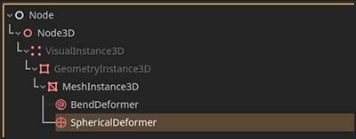
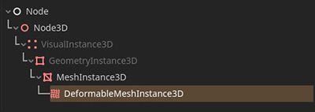
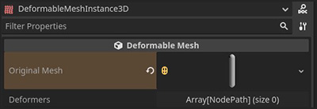
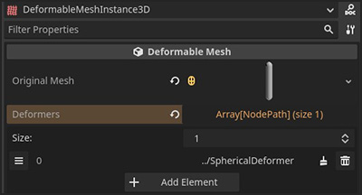
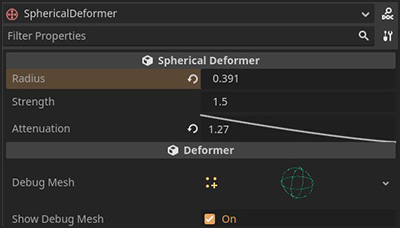

 

## godot-deformablemesh
**This addon allows to deform 3D meshes using customizable deformers at run-time. In this version SphericalDeformer nodes are provided.**

 

  
  
  

## Getting Started

1. Download the [repository](https://github.com/cloudofoz/godot-curvemesh/archive/refs/heads/main.zip](https://github.com/cloudofoz/godot-deformablemesh/archive/refs/heads/main.zip)) or download the (stable) addon from the AssetLib in Godot ([link](https://godotengine.org/asset-library/asset/1794)).
2. Import the **addons** folder into your project.
3. Activate `DeformableMesh` under * *Project > Project Settings > Plugins.* *

4. Add a `DeformableMeshInstance3D` node to the scene.

5. Add the mesh resource you want to deform in the `Original Mesh` property.

6. Add a `SphericalDeformer` node to the scene.

7. Add the `DeformableMeshInstance3D` node you created before in the `Deformables` property.

8. Tweak the `SphericalDeformer` parameters to adjust the deformation

## Changelog

v0.10

- first release

## License

[MIT License](/LICENSE.md)
